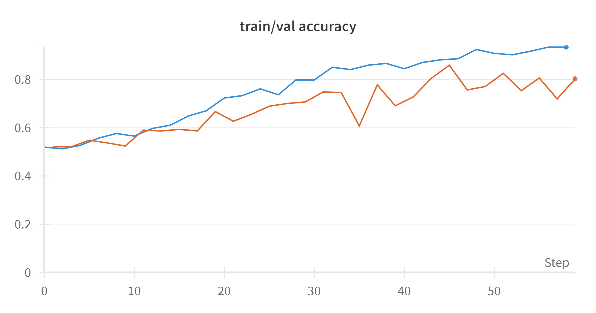
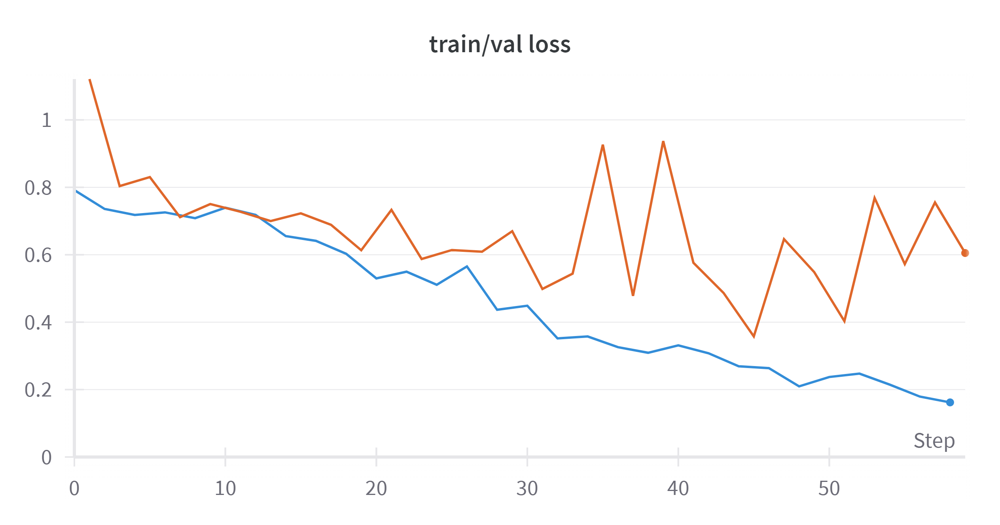
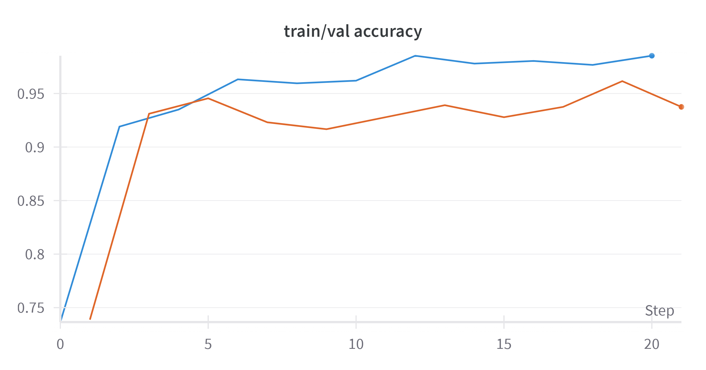
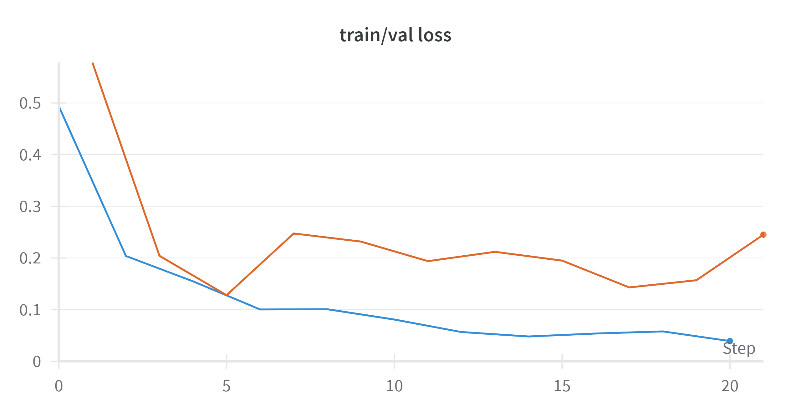

# Building a ResNet model for image classification

The experimental dataset consists of grayscale images for classifying sedan and pickup truck vehicles

## Resnet50 implement:
- Constructing model according to the author's proposal
- Apply some augmentation techniques to enhance training data: HorizoneFlip, Blur, BrightnessContrass
- Train the model with the configuration:
  `LR` *0.0001*
  `EPOCHS` *30*

  

**Evaluate the model**: The model performs well on the training dataset (blue line) but poorly on the validation dataset (orange line). Based on the graph, it appears that the model lacks generalization and is experiencing slight overfitting.

### Resnet50 Pytorch API:
- I'm using the `ResNet50` model `PyTorch` with pretrained weights `IMAGENET_1K`.
- Training the model with `LR` *0.0001*, `EPOCHS` *30*

  

**Evaluate the model**: With transfer learning, the model converges very quickly in the initial epochs, with accuracy on the training set reaching 0.95 and on the validation set reaching 0.93